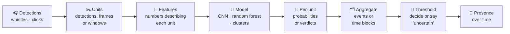
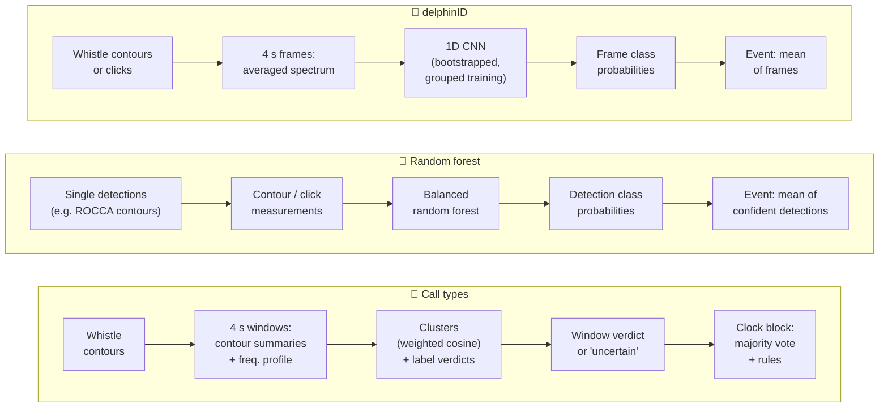
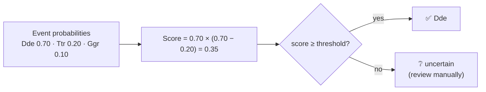

# How the classifiers work

Three ways to turn PAMGuard detections into species (or population) decisions. They share one pattern: **small units → features → model → probabilities → aggregated over time → thresholded decision**.



## The three workflows



All three write the same [standard output](../schemas/classifier_output.md), so **transfer learning** 🔁 can stack them: an event-level random forest on the mean probabilities of any mix of base classifiers, for labels none of them were trained on.

## What they share, and where they differ

| | 🧠 delphinID | 🌲 Random forest | 🎼 Call types |
|---|---|---|---|
| **Unit** | Detection frame (default 4 s) | One detection | Window (default 4 s, 50 % overlap) |
| **Features** | Averaged spectrum of the frame's contours or clicks (PAMGuard's transforms) | Measurements of each contour or click | Means and spreads of contour measurements, longest contour, occupancy, frequency profile |
| **Learning** | Supervised: small CNN, retrained on capped bootstrap samples of each group | Supervised: balanced random forest, capped per group | Mostly unsupervised: clusters, weighted by which features separate known call types; clusters then judged per label |
| **Labels needed** | Labelled encounters | Labelled encounters | Annotated calls on some days (not all) |
| **Per-unit output** | Class probabilities | Class probabilities | Cluster + verdict (positive / negative / uncertain) |
| **Aggregation** | Event: mean frame probabilities | Event: mean probabilities of detections above a score | Clock-aligned block: strict majority of windows with a verdict |
| **Decision threshold** | Decision score at event level | Minimum detection score + minimum event score | Distance limits for joining a cluster, credible interval for verdicts, majority, optional rules |
| **Testing** | Leave one group out | Leave one group out | Leave one day out |

### 🗂️ Why aggregate?
Single detections are noisy; animals are present for minutes to hours. Averaging many units over an **event** (an encounter, a recording, a fixed time bin) or a **clock block** (e.g. 10 min) cancels much of the noise, and accuracy usually rises sharply from units to events.

### 🚦 Thresholding: trading coverage for accuracy
Every decision has a confidence. Low-confidence decisions are returned as **uncertain** instead of being forced into a class.

- **Decision score** (delphinID, random forest, transfer learning): p₁ × (p₁ − p₂), the top probability times its lead over the runner-up. High only when the model is both confident and unambiguous.
- **Verdicts** (call types): a cluster speaks for a label only if its share of that label is credibly above (or below) the overall rate, on enough days; a block decides only with a strict majority.
- Raising a threshold → fewer decisions, more of them right. The **threshold curves** from cross-validation show this trade-off, so a threshold can be chosen for the accuracy a project needs.



## 📅 Monitoring presence over time

Run on continuous recordings, each workflow gives a **decision per event or time block**, which stacks into a presence timeline:

```
            00  02  04  06  08  10  12  14  16  18  20  22   (hour, UTC)
Species X   ·   ·   ·   ✅  ✅  ·   ·   ·   ❔  ✅  ·   ·
Species Y   ·   ✅  ✅  ·   ·   ·   ·   ·   ·   ·   ·   ·
Noise       ·   ·   ·   ·   ·   ·   🔇  🔇  ·   ·   ·   ·
```

- **Presence metrics**: detection-positive blocks, hours or days per species; seasonal and diel patterns; occurrence before, during and after an activity (e.g. construction).
- **Known accuracy**: thresholds chosen from cross-validation give each "present" a known reliability; "uncertain" blocks are a short list for manual review instead of hours of audio.
- **Combining evidence**: whistle, click and call-type classifiers share one output format, so they can be combined per event (transfer learning) or simply shown side by side.
- **Running live**: delphinID models run inside PAMGuard; call-type libraries run anywhere with the numpy-only `standalone.py`, e.g. classifying each new block as it arrives. Optional block rules (e.g. "barely varying frequency → noise") keep known false alarms out of the timeline.
